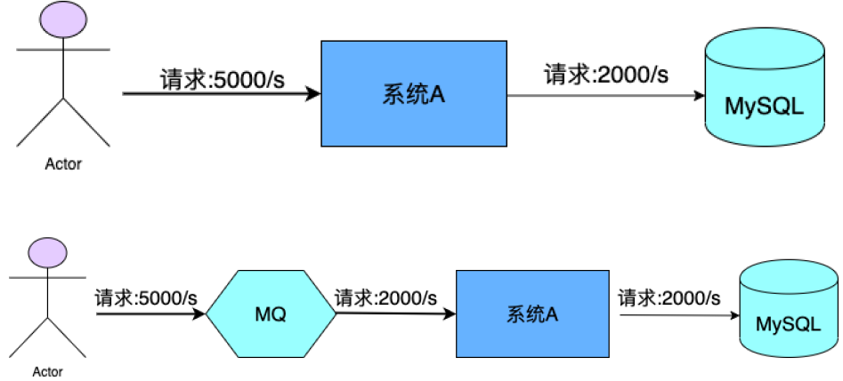
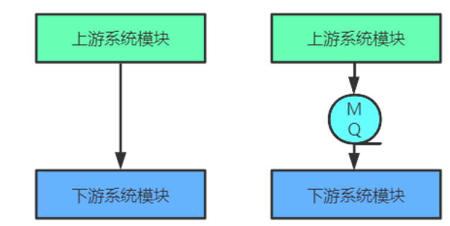

# MQ在架构中的用途

## 1、限流削峰

MQ可以将下游系统承载不了的超出的流量进行暂时存储，以便下游系统可以按自己的处理速度慢慢处理，从而避免请求丢失或下游系统被压跨。

## 2、异步解耦

上游系统与下游系统调用如果为同步调用，那整个链条的系统吞吐量能力和并发能力都会大大降低，且上下游系统的耦合度也非常高。异步调用就可以解决这个问题。

## 3、数据收集

分布式系统会产生海量级数据流，如业务日志、监控数据、用户行为日志等。对这些数据流进行实时或近的批量实时数据采集汇总，然后用于大数据分析，已是互联网的必备技术。

