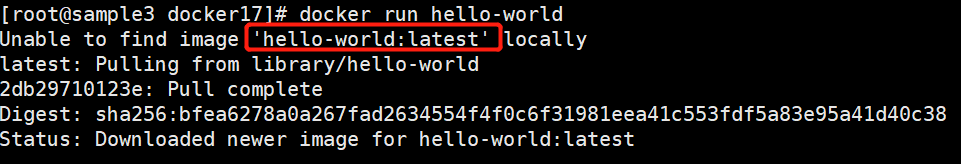

# 安装说明

本文陈述的是在线安装，非下载 rpm 包离线安装

## 1、下载地址

下面的是针对centos 7.x环境需要的docker安装包下载地址，如果需要centos 8.x可以改地址即可获得

```shell
# 官网地址
# https://docs.docker.com/install/linux/docker-ce/centos/
# 安装包下载地址
# https://download.docker.com/linux/centos/7/x86_64/stable/Packages/
```

## 2、安装依赖

```shell
# yum install -y yum-utils device-mapper-persistent-data lvm2
# yum-config-manager --add-repo  https://download.docker.com/linux/centos/docker-ce.repo
```

 ## 3、安装docker

```shell
# yum install containerd.io
# yum install docker-ce
# yum install docker-ce-cli 
```

## 4、启动docker

```shell
# systemctl start docker
#  docker --version
```

## 5、设置开机自启动

```shell
# systemctl enable docker
```

## 6、测试

```shell
# docker run hello-world
```



红框内表示组件名:版本号，如果不写版本号，默认为最新稳定版。
