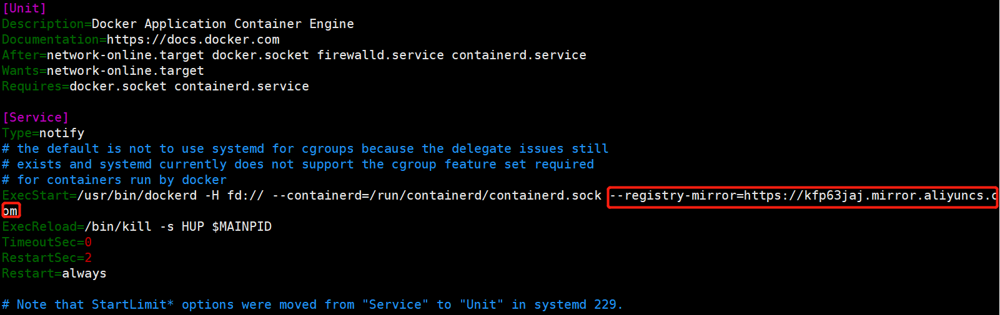
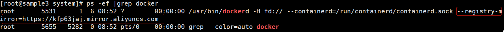

# 加速配置

因受墙隔离，通过docker访问外网资源可能会非常慢。通过代理来解决这个困难，阿里的镜像代理就是其中之一

## 1、注册自己的代理地址

```shell
https://dev.aliyun.com/search.html
```

## 2、拷贝docker.service

```shell
# cp /lib/systemd/system/docker.service /etc/systemd/system/docker.service
```

## 3、授权

```shell
# chmod 777/etc/systemd/system/docker.service
```

## 4、修改docker.service

```shell
# vim docker.service
```



在ExecStart配置项目增加阿里的代理镜像

```shell
--registry-mirror=https://kfp63jaj.mirror.aliyuncs.com
```

其中这里的  **https://kfp63jaj.mirror.aliyuncs.com** 是第一步自己在阿里云上注册的属于自己的免费镜像地址，当然也可以使用别人的。

## 5、重载docker.service管理脚本服务

因为docker.service脚本做了修改了，所以需要重载下该service服务

```shell
# systemctl daemon-reload
```

## 6、重启docker服务

```shell
# systemctl restart docker
```

## 7、查看docker进程

```shell
# ps -ef |grep docker
```



查看进程，如有显示上图带有红框内容的信息，表示加速配置成功。