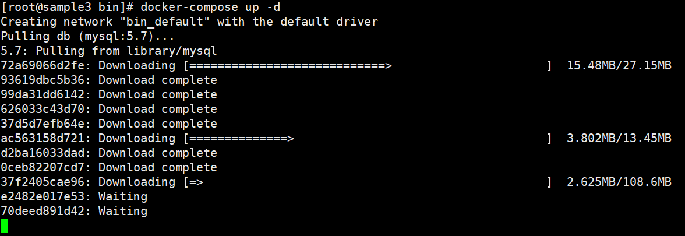

# Compose使用

## 1、安装docker-compose

```shell
# sudo curl -L "https://github.com/docker/compose/releases/download/1.27.4/docker-compose-$(uname -s)-$(uname -m)" -o /usr/local/bin/docker-compose
```

## 2、设置可执行权限

```shell
# sudo chmod +x /usr/local/bin/docker-compose
```

## 3、创建软链

```shell
# sudo ln -s /usr/local/bin/docker-compose /usr/bin/docker-compose
```

## 4、查看版本

```shell
# docker-compose version
```

## 5、yml配置文件编写

docker-compose.yaml文件配置内容：

```yaml
version: "2"
services:

  db:
    image: mysql:5.7
    restart: always
    environment:
      MYSQL_ROOT_PASSWORD: somewordpress
      MYSQL_DATABASE: wordpress
      MYSQL_USER: wordpress
      MYSQL_PASSWORD: wordpress

  wordpress:
    depends_on:
      - db
    image: wordpress:latest
    restart: always
    ports:
      - "8000:80"
    environment:
      WORDPRESS_DB_HOST: db:3306
      WORDPRESS_DB_USER: wordpress
      WORDPRESS_DB_PASSWORD: wordpress
```

## 6、执行docker-compose

```shell
# docker-compose up -d
```



## 7、查看日志

查看docker-compose下服务的日志

```shell
# docker-compose logs
```

## 8、查看状态 

查看docker-compose下服务状态

```shell
# docker-compose ps
```

