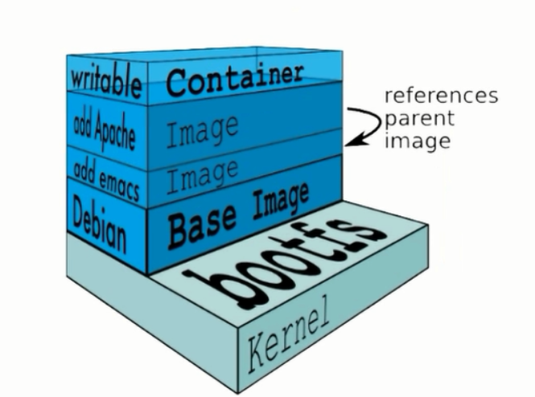

# 镜像



```shell
# docker rm -f $( docker ps -a -q ) #清空本地环境
# docker ps -a
# docker images
# docker run --name test centos:6.8 # 没有守护进程，失败案例演示
# docker ps -a 
# docker pull hub.c.163.com/public/centos:6.7-tools #拉取容器镜像
# docker images
# docker run --name mysql -d hub.c.163.com/public/centos:6.7-tools #安装容器
# docker ps -a
# docker exec -it mysql /bin/bash #进入容器
# yum -y install mysql mysql-server # 在容器里安装mysql
# service mysqld start # 启动mysql
# chkconfig mysqld on
# mysqladmin -uroot password 123
# mysql -uroot -p #登录
# exit #退出mysql
# exit #退出容器
# docker ps -a
# docker commit mysql mysql:5.1 #创建mysql容器
# docker images #可以看到刚创建的容器
# docker run --name mysql-my -d 768b332 #运行新创建的容器768b332为image ID 前7位
# docker exec -it cef94d6 /bin/bash #进入该容器 cef94d6为容器id前7位
```

