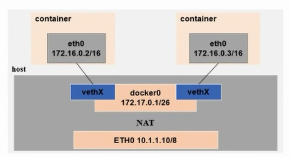
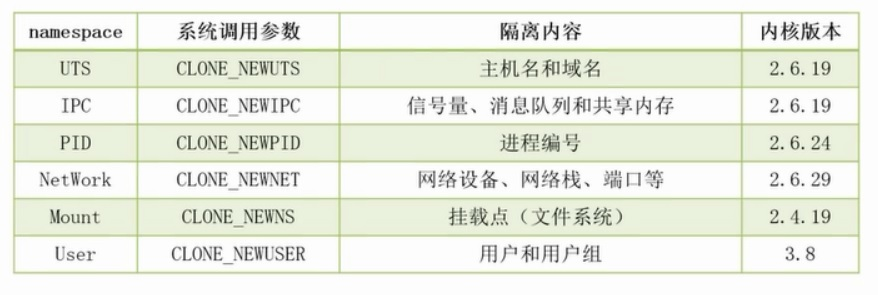

# 网络通信

## 1、通信场景

- 容器与容器之间通信

  容器A与容器B通信，是通过docker0网桥实现的

- 容器访问外部网络

  通过防火墙的SNAT实现

  ```shell
  # iptables -t nat -A POSTROUTING -s 172.17.0.0/16 -o docker0 -j MASQUERADE
  ```

  

- 外部网络访问容器

  通过防火墙的DNAT实现

  ```shell
  # docker run -d -p 80:80 apache
  
  # iptables -t nat -A PREROUTING -m addrtype --dst-type LOCAL -j DOCKER
  # iptables -t nat -A DOCKER ! -i docker0 -p tcp -m tcp --dport 80 -j DNAT --to-destination 172.17.0.2:80
  ```

  

## 2、架构

通常Docker使用网桥（Bridge）与NAT的通信



## 3、容器间网络隔离

容器间的网络隔离通过namespace实现



## 4、docker进程网络修改

```shell
# -b, --bridge="" 指定docker使用的网桥设备，默认情况下docker会自动创建和使用docker0网桥设备，通过此参数可以使用已经存在的设备
# --bip 指定docker0的IP和掩码，使用标准的CIDR形式，如10.10.10.10/24
# --dns配置容器的DNS，在启动docker进程时添加，所有容器全部生效
```

## 5、docker容器网络修改

```shell
# --dns 用于指定启动的容器的DNS
# --net用于指定容器的网络通讯方式，有以下四个值
# 1、bridge:docker默认方式，网桥模式
# 2、none：容器没有网络栈
# 3、container:使用其它容器的网络栈，docker容器会加入其它容器的network namespace
# 4、host:表示容器使用Host的网络，没有自己独立的网络栈。容器可以完全访问Host的网络，不安全	
```

## 6、暴露端口修改

```shell
# -p/P 选项的使用格式
# 1、-p :<ContainerPort> 将制定的容器端口映射至主机所有地址的一个动态端口
# 2、-p <HostPort>:<ContainerPort>:映射至指定的主机端口
# 3、-p <IP>::<ContainerPort>:映射至批定的主机的IP的动态端口
# 4、-p <IP>:<HostPort>:<ContainerPort>:映射至指定的主机IP的主机端口
# 5、-P(大P): 暴露所需要的所有端口
```

```shell
# docker port ContainerName 可以查看容器当前的映射关系
```

## 7、自定义Docker0网桥的网络地址修改

修改/etc/docker/daemon.json文件

```shell
{
	"bip":"192.168.1.5/24",
	"fixed-cidr":"10.20.0.0/16",
	"fixed-cidr-v6":"2001:db8::/64",
	"mtu":"1500",
	"default-gateway":"10.20.1.1",
	"default-gateway-v6":"2001:db8:abcd::89",
	"dns":["10.20.1.2","10.20.1.3"]
}
```


