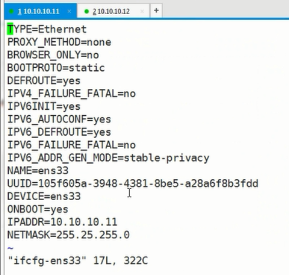
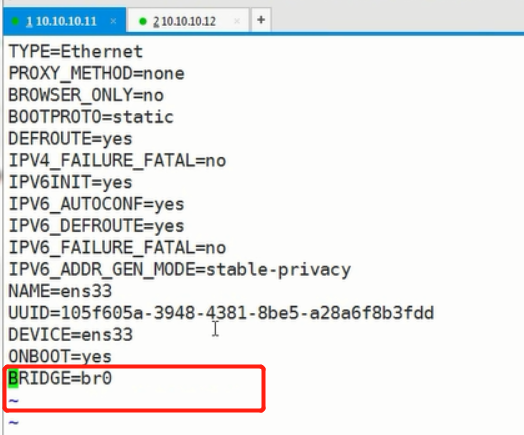
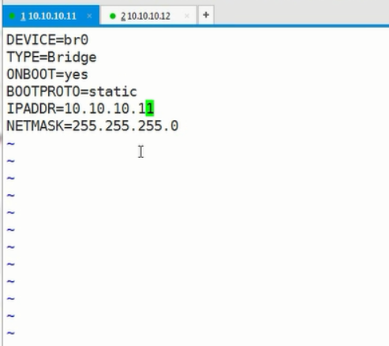

# 网络隔离

## 1、命令

```dockerfile
# docker network ls 查看当前可用的网络类型
# docker network create -d 类型 网络空间名称
# 类型分为：1、overlay network;2、bridge network
```

实际操作

```shell
# docker network ls # 查看网络
# docker network create -d bridge lamp # 创建名为lamp的网桥
# docker network create -d bridge lnmp # 创建名为lnmp的网桥
# docker network ls # 查看网络,能看到上面创建的lamp、lnmp
# ifconfig #查看网络详细信息，能看到lamp、lnmp的网络信息
# docker run --name tomcat11 --network=lamp -d tomcat:v1.0 # 启动一个容器来运行tomcat,容器的名称为tomcat11,使用lamp网络,通过-d设置后台运行，tomcat版本是v1.0
# docker run --name tomcat22 --network=lnmp -d tomcat:v1.0 # 启动一个容器来运行tomcat,容器的名称为tomcat22,使用lnmp网络,通过-d设置后台运行，tomcat版本是v1.0
# docker exec -it tomcat11 /bin/bash #进入tomcat11容器的/bin/bash目录下
# ifconfig #查看当前容器的网络信息
# ping 172.21.0.2 #不通，两容器间的网络做了隔离
# ping www.baidu.com # 正常
# docker network ls # 查看网络
# docker ps -a # 查看进程
# docker inspect tomcat 
# exit # 退出容器
# docker rm -f $( docker ps -a -q ) # 删除正在运行的容器进程
# docker images # 镜像查看

```

```shell
# vim ifcfg-eth0
```

```shell
DEVICE=eth0
HWADDR=00:0C:29:06:A2:35
TYPE=Ethernet
UUID=34706cc-aa46-4be3-91fc-d1f48c301f23
ONBOOT=yes
BRIDGE=br0
NM_CONTROLLED=yes
BOOTPROTO=static
```

```shell
# vim ifcfg-br0
```

```shell
DEVICE=br0
TYPE=Bridge
ONBOOT=yes
BOOTPROTO=static
IPADDR=192.168.216.131
NETMASK=255.255.255.0
GATEWAY=192.168.216.2
DNS=8.8.8.8
```


通过修改配置文件创建网桥，以使容器间能通信

```shell
# cd /etc/sysconfig/network-scripts/ # 进入网络配置文件目录
# cp -a ifcfg-ens33 ifcfg-br0
# vim ifcfg-ens33
```

原ifcfg-ens33文件



修改后的ifcfg-ens33文件



去掉了IPADDR、NETMASK增加了BRIDGE

对ifcfg-br0进行修改，删除原来所有内容，修改后的结果如下：



重启网络

```shell
# service network restart
# ifconfig # 查看修改后的网络配置信息
```

使用pipework给容器指定IP

```shell
# yum install -y git
# git clone https://github.com/jpetazzo/pipework
# cp pipework/pipework /usr/local/bin/
# docker run -itd --net=none --name=ff centos-6-x86 bash
# pipework br0 f1 192.168.216.135/24
```


```dockerfile
# docker run --name tomcat --net=none -d tomcat:v1.0 # 启动镜像
# pipework br0 tomcat 10.10.10.16/24 #给容器tomcat指定IP
```

