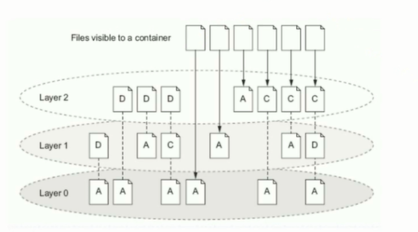
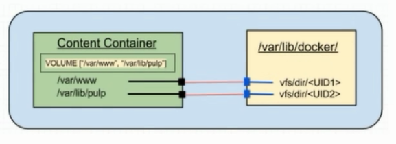
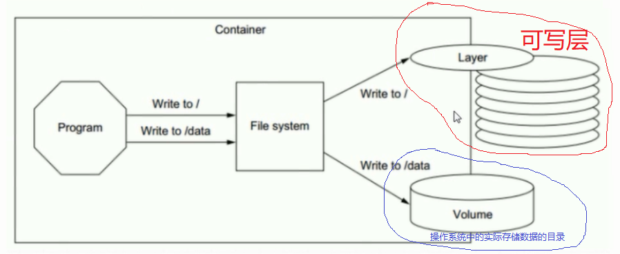
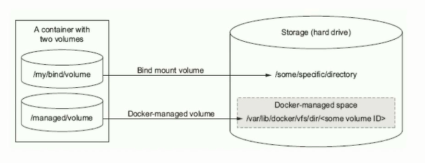

# 数据存储特性

## 1、原理

docker镜像由多个只读层叠加而成，启动容器时，docker会加载只读镜像层并在镜像栈顶部添加一个读写层。

如运行中的容器修改了一个已存在的文件，那么容器会从下面的只读层复制文件到读读写层，该文件的只读版本仍然存在，只是已被读写层中该文件的副本所隐藏，这就是“写时复制”机制。

## 2、卷

卷是容器上的一个或多个目录，此类目录可绕过联合文件系统，与宿主机上的某目录绑定。

Volume可以在运行容器时，完成创建和绑定操作。但需要拥有对应的申明。

Volume的目的是数据持久化。

当容器被删除，可写层随之也被清掉，但操作系统中的实际存储数据的目录下的数据是在的，不会随着被清掉。

绑定卷可以是操作系统的任何目录，它由人为配置和管理。

管理卷通常是在/var/lib/docker/vfs/目录下，它由docker容器管理。