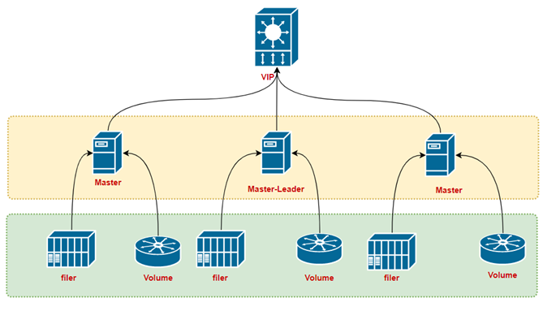
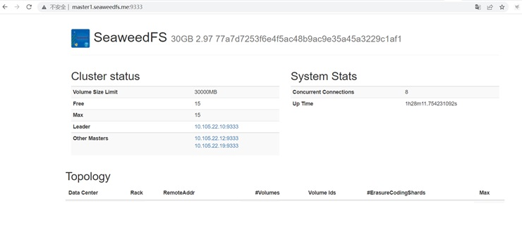
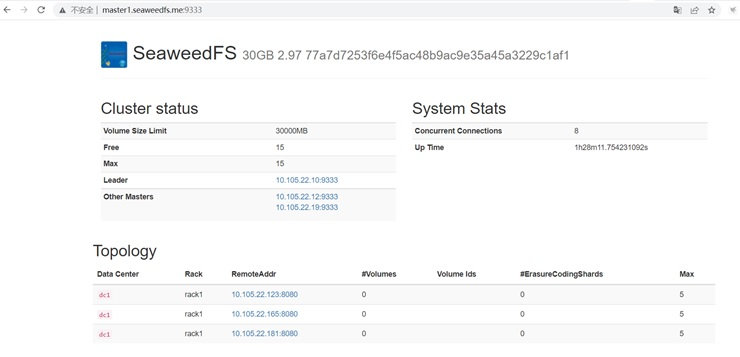
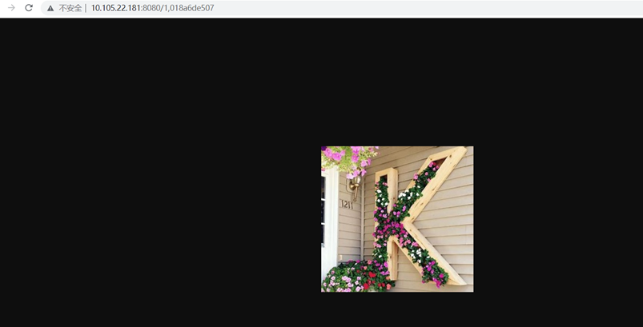

# seaweedfs集群搭建

## 1、部署架构



## 2、部署seaweedfs-master集群

部署3个master节点

### 2.0、关闭防火墙

```shell
# systemctl stop firewalld.service
# firewall-cmd --state
```


### 2.1、下载seaweedfs安装文件

```shell
# wget https://github.com/chrislusf/seaweedfs/releases/download/2.97/linux_amd64.tar.gz
```

### 2.2、创建安装目录

```shell
# mkdir /usr/local/seaweedfs
# mkdir /usr/local/seaweedfs/metadata
# mkdir /usr/local/seaweedfs/data
```

### 2.3、安装

```shell
# chmod 755 linux_amd64.tar.gz 
# tar -zxvf linux_amd64.tar.gz -C /usr/local/seaweedfs/
```

### 2.4、创建seaweedfs用户并授权

```shell
# getent group seaweedfs || groupadd -r seaweedfs
# getent passwd seaweedfs || useradd -r -d /opt -s /bin/nologin -g seaweedfs seaweedfs
# chown -R seaweedfs:seaweedfs /usr/local/seaweedfs # 更改文件权限
```

### 2.5、配置开机启动服务脚本

```shell
# cd /usr/lib/systemd/system
# vim seaweedfs-master.service
# systemctl daemon-reload
```

#### 2.5.1、seaweedfs-master.service

```shell
[Unit]
Description=SeaweedFS Master
After=network.target

[Service]
Type=simple
User=seaweedfs
Group=seaweedfs

ExecStart=/usr/local/seaweedfs/weed -v=0 master -ip 10.105.22.12 -port=9333 -defaultReplication=000 -mdir=/usr/local/seaweedfs/metadata -peers=10.105.22.12:9333,10.105.22.19:9333,10.105.22.10:9333
WorkingDirectory=/usr/local/seaweedfs/
SyslogIdentifier=seaweedfs-master1

[Install]
WantedBy=multi-user.target
```

> 3个主节点的搭建操作都一样。这3个节点是通过 **-peers** 这里的设置构成集群的。每个节点只是 **-ip** 这里不一样，其它配置都一样。

### 2.6、启动seaweedfs-master服务

```shell
# systemctl start seaweedfs-master
# ps -ef|grep seaweedfs
```

### 2.7、查看master控制台



## 3、部署seaweedfs-volume集群

部署3个volume节点

### 3.1、关闭防火墙

与master相同

```shell
# systemctl stop firewalld.service
# firewall-cmd --state
```

### 3.2、创建安装目录

与master相同

```shell
# mkdir /usr/local/seaweedfs
# mkdir /usr/local/seaweedfs/metadata
# mkdir /usr/local/seaweedfs/data
```

### 3.3、安装（与master使用一套安装文件）

```shell
# chmod 755 linux_amd64.tar.gz 
# tar -zxvf linux_amd64.tar.gz -C /usr/local/seaweedfs/
```

### 3.4、创建seaweedfs用户并授权

与master相同

```shell
# getent group seaweedfs || groupadd -r seaweedfs
# getent passwd seaweedfs || useradd -r -d /opt -s /bin/nologin -g seaweedfs seaweedfs
# chown -R seaweedfs:seaweedfs /usr/local/seaweedfs # 更改文件权限
```

### 3.5、配置开机启动服务脚本

```shell
# cd /usr/lib/systemd/system
# vim seaweedfs-volume.service
# systemctl daemon-reload
```

#### 3.5.1、seaweedfs-volume.service

```shell
[Unit]
Description=SeaweedFS Volume
After=network.target

[Service]
Type=simple
User=seaweedfs
Group=seaweedfs

ExecStart=/usr/local/seaweedfs/weed -v=0 volume -max=5 -mserver=10.105.22.12:9333,10.105.22.19:9333,10.105.22.10:9333 -ip=10.105.22.123 -port=8080 -dir=/usr/local/seaweedfs/data -dataCenter=dc1 -rack=rack1
WorkingDirectory=/usr/local/seaweedfs/
SyslogIdentifier=seaweedfs-volume

[Install]
WantedBy=multi-user.target
```

> 3个卷节点的搭建操作都一样。这3个节点是通过 **-mserver** 挂靠到master集群上的。每个节点只是 **-ip** 这里不一样，其它配置都一样。

### 3.6、启动seaweedfs-volume服务

```shell
# systemctl start seaweedfs-volume
# ps -ef|grep seaweedfs
```

### 3.7、查看master控制台



## 4、使用

### 4.1、获取fid

```shell
# curl http://10.105.22.10:9333/dir/assign
{"fid":"1,018a6de507","url":"10.105.22.181:8080","publicUrl":"10.105.22.181:8080","count":1}
```

> 在上传文件时会用到这里返回的**fid，url**

### 4.2、上传文件

```shell
# curl -F file=@/home/zhangyanqing/seaweedfs-test/1.jpg 10.105.22.181:8080/1,018a6de507
{"name":"1.jpg","size":43213,"eTag":"1ab46659"}
```

> 10.105.22.181:8080/1,018a6de507
>
> 这里的**10.105.22.181:8080**是上面获取fid步骤中的**url**
>
> 这里的**1,018a6de507**是上面获取fid步骤中的**fid**

### 4.3、浏览文件

通过shell浏览

```shell
# curl http://10.105.22.10:9333/dir/lookup?volumeId=1
{"volumeOrFileId":"1","locations":[{"url":"10.105.22.181:8080","publicUrl":"10.105.22.181:8080"}]}
```

> **http://10.105.22.10:9333**是master集群leader的地址
>
> **volumeId=1**中的**1**是获取的fid中逗号前的值**1**,018a6de507

### 4.4、浏览文件

通过浏览器浏览

```shell
http://10.105.22.181:8080/1,018a6de507
```

