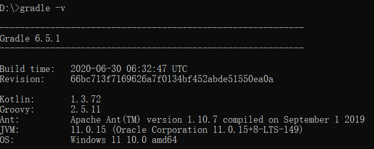

# 使用idea对spring framework源码debug

说明：请严格按照几个版本来搭建环境，否则可能会编译不了发生各种问题。

## 1、版本

> **spring framework 5.3.10** ==[重要]==
>
> **IntelliJ IDEA 2020.2.4** 
>
> **gradle-6.9.1** ==[重要]==
>
> **jdk-11.0.15** ==[重要]==

## 2、下载地址

spring framework 5.3.10

```shell
# https://gitee.com/ellisonpei/spring-framework-5.3.10.git
```

gradle-6.9.1

```shell
# https://downloads.gradle-dn.com/distributions/gradle-6.9.1-bin.zip
```

jdk-11.0.15

```shell
# https://www.oracle.com/java/technologies/javase/jdk11-archive-downloads.html
# https://download.oracle.com/otn/java/jdk/11.0.15+8/c4e1848573124815b77d6f1843afccb5/jdk-11.0.15_windows-x64_bin.zip?AuthParam=1652338291_536e45373fe4d93c52990401b07068df
```

## 3、搭建步骤

### 3.1、配置环境变量

- 配置jdk11、gradle6.9.1环境变量（略）
- 验证版本




### 3.2、对代码进行预编译

```shell
# gradlew spring-oxm:compileTestJava
```

如有错，解决错误，最终要成功，这是前提。

### 3.3、把build.gradle导入idea

```shell
# File -> New -> Project from Existing Sources -> Navigate to directory -> Select build.gradle
```

这块是最耗时的，只需等待。

### 3.4、排除掉 spring-aspects 模块配置

在**settings.gradle**文件中把 **include "spring-aspects"** 注释掉

### 3.5、在spring-core模块中创建测试类进行debug

**UserService.java**

```java
package com.mangxiao;
public class UserService {

	public UserService(){
		System.out.println("UserService init ....");
	}
}
```

**AppConfig.java**

```shell
package com.mangxiao;

import org.springframework.beans.factory.annotation.Configurable;
import org.springframework.context.annotation.Bean;

@Configurable
public class AppConfig {
	@Bean
	private UserService user() {
		return new UserService();
	}
}
```

**BeanTest.java**

```java
package com.mangxiao;
import org.springframework.context.annotation.AnnotationConfigApplicationContext;
public class BeanTest {
	public static void main(String[] args) {
		AnnotationConfigApplicationContext applicationContext = new AnnotationConfigApplicationContext(AppConfig.class);
		UserService serviceService = applicationContext.getBean(UserService.class);
		System.out.println(serviceService);
	}
}
```

